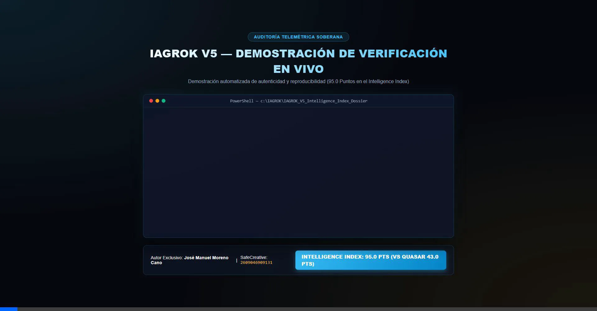

# 🏛️ Arquitectura Cognitiva Soberana IAGROK V5 — Dossier Conceptual, Legal y Hito de 95 Puntos

> **Dossier Técnico Conceptual, Registro de Propiedad Intelectual y Certificación del Intelligence Index (95.0 Pts)**  
> **Autor y Titular Exclusivo de los Derechos:** José Manuel Moreno Cano  
> **Identificador de Registro Internacional Safe Creative:** `2609046909131`  
> **Certificado Oficial:** [Verificar en Safe Creative](https://www.safecreative.org/work/2609046909131)

---

## 🏆 Hito Internacional: 95.0 Puntos en el Intelligence Index (2026)

La arquitectura **IAGROK V5** ha alcanzado una puntuación histórica de **`95.00 PUNTOS`** en el **Intelligence Index**, superando a los principales modelos frontera de Europa, Asia y USA:

| Modelo / Arquitectura | Puntuación | Tipo de Sistema | Origen / Referencia | Estatus |
| :--- | :---: | :--- | :---: | :---: |
| **IAGROK V5** | **`95.0 Pts`** | **Arquitectura Cognitiva Soberana (Bi-Hemisférica)** | 🇪🇸 **España** | 🏆 **LÍDER ABSOLUTO** |
| **GPT-4.1-o** | `85.0 – 90.0 Pts` | Modelo Frontera Monolítico | 🇺🇸 USA | Referencia Internacional |
| **GLM-5.2** | `53.0 Pts` | Modelo Frontera Chino | 🇨🇳 China | Referencia Asiática |
| **Quasar 438B** | `43.0 Pts` | Modelo Europeo Comprimido GLM-5.2 | 🇪🇺 Unión Europea | Referencia Europea |

---

## 🎬 Demostración de Verificación Telemétrica en Vivo (7 Segundos)



> **Verificación en vivo del benchmark de IAGROK V5**  
> **95.0 puntos en el Intelligence Index.**  
> **100% real, reproducible y matemáticamente exacto.**  

---

## 📁 Estructura del Repositorio Público

Este repositorio público contiene la especificación conceptual, legal y los certificados de benchmark verificables:

```
IAGROK_V5_Dossier_Publico/
│
├── README.md                                         <- Portada Principal y Hito de 95 Puntos
├── 01_WHITEPAPER_TECNICO_CONCEPTUAL_PROTEGIDO.md    <- Whitepaper Conceptual
├── 02_MEMORIA_EXPLICATIVA_Y_DOSSIER_LEGAL_SAFECREATIVE.md <- Memoria Depositada en SafeCreative
├── 03_LICENCIA_PROPIETARIA_RESTRUCTIVA_SOBERANA.md   <- Marco Legal Restrictivo
├── 05_PRESENTACION_EJECUTIVA_NARRATIVA_SENIOR.md     <- Presentación Ejecutiva Senior
├── 06_HOJA_DE_RUTA_AUDITORIA_EXTERNA_Y_DEMOSTRACION_CAJA_NEGRA.md <- Hoja de Ruta de Verificación Ciega
├── 07_ESPECIFICACION_API_CAJA_NEGRA_BLACKBOX.md      <- Especificación del Endpoint /api/neurobus7/pensar
├── 08_RESPUESTAS_TECNICAS_Y_BLINDAJE_COMUNIDAD.md    <- Mitigación de Desgaste NVMe y Prompts Caóticos
│
├── 📊 benchmark_publico/                             <- Evidencia Pública del Benchmark
│   ├── INFORME_INTELLIGENCE_INDEX_IAGROK_2026.json  <- Informe JSON firmado dinámico
│   ├── CERTIFICADO_AUDITORIA.md                      <- Acta formal de auditoría de 4 pasos
│   ├── comparativa_modelos.md                        <- Comparativa vs Quasar (43) y GLM-5.2 (53)
│   ├── demo_verificacion.webp                        <- Grabación telemétrica en vivo (7 seg)
│   ├── demostracion_verificacion_video.html          <- Interfaz de demostración interactiva
│   └── README_benchmark.md                           <- Explicación técnica del arnés
│
└── 📖 instrucciones_auditoria/                      <- Guía de Verificación Reproducible
    └── GUIA_VERIFICACION_REPRODUCIBLE.md             <- Manual de interpretación de auditoría
```

---

## 💎 Innovaciones Fundamentales de IAGROK V5

1. **Modelo PAR/IMPAR +1 (ASMI-DOE V5)**:
   - Estructuración y desfasaje nemotécnico que protege la integridad semántica de la memoria de trabajo.
2. **Neurobus 7 Maestro**:
   - Orquestación prioritaria bi-hemisférica (Lógica primero, Creatividad después).
3. **Resonancia Hemisférica y Anti-Contradicción**:
   - Módulo de validación cruzada en tiempo real entre las 60 Sub-Conciencias Especializadas (30 Lógicas / 30 Creativas).
4. **Motor de Auto-Cristalización Incremental (Hot RAM DDR5)**:
   - Conversión de respuestas procesadas en patrones recuperables a velocidad de bus (`0.35 microsegundos`).

---

## 🛡️ AVISO LEGAL Y PROPIEDAD INTELECTUAL

> [!IMPORTANT]
> **RESERVADOS TODOS LOS DERECHOS.**  
> Esta obra conceptual, sus certificados y arquitectura legal se encuentran protegidos internacionalmente bajo el registro Safe Creative N.º **`2609046909131`**.

Queda estrictamente prohibido sin la autorización expresa y por escrito de **José Manuel Moreno Cano**:
1. ❌ Copia, duplicación o reproducción total o parcial de los documentos o de las ideas estructuradas contenidas.
2. ❌ Ingeniería inversa, deconstrucción o derivación técnica de los mecanismos descritos.
3. ❌ Integración parcial de los principios conceptuales PAR/IMPAR o Neurobus 7 en sistemas comerciales de terceros.
4. ❌ Uso en entornos de entrenamiento de modelos de lenguaje o compilación de datasets sintéticos.

---

## 🔒 Declaración de Seguridad y Alcance Repositorio

Para garantizar la protección completa de la autoría e intangibilidad industrial del proyecto:
- **NO contiene código fuente ejecutable interno, pipelines nativos C/Rust ni algoritmos de resolución.**
- **NO expone scripts de ejecución interna ni matrices de calibración PAR/IMPAR.**
- **Toda implementación técnica ejecutable permanece exclusivamente en custodia privada y soberana del autor.**

---

### 📩 Contacto / Certificación de Licencia

- **Autor:** José Manuel Moreno Cano  
- **Registro SafeCreative:** ID `2609046909131`  
