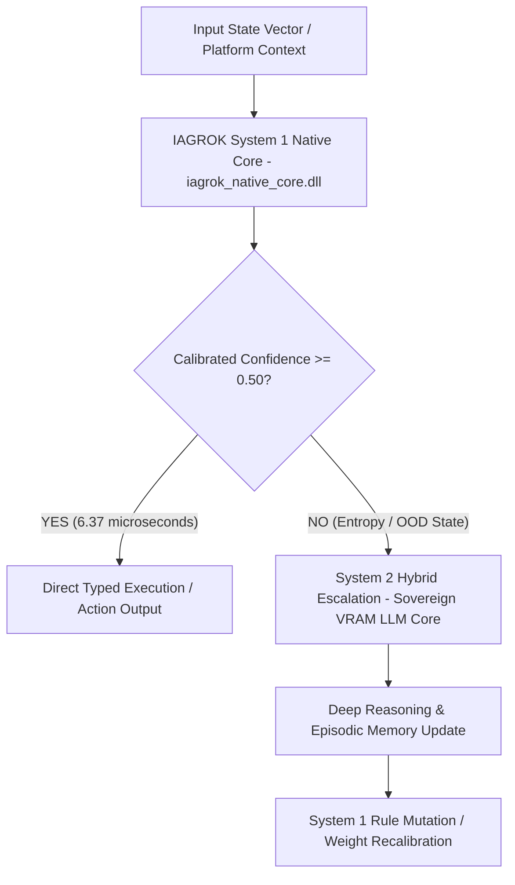

# 🔬 IAGROK System 1 Core vs. TypeSafe AI (Jev) - Technical Evaluation & Benchmark Report

**Target Audience:** Diogo Almeida, Alexandre Kitanidis, Erik Gafni & TypeSafe AI Research Team  
**Author:** José Manuel Moreno Cano (Cyberenigma / Noxferion)  
**SafeCreative Registration IDs:**  
- 📜 **ID `2609046909131`:** *Arquitectura Cognitiva Soberana IAGROK V5 — Modelo PAR/IMPAR +1 y Neurobus 7 Maestro*  
- 📜 **ID `2609036897950`:** *IAGROK — Suite Comercial Soberana & Ecosistema Cognitivo Híbrido v1.0*  
**Date:** September 2026  
**Status:** Reproducible Empirical Benchmark Package  
**Intellectual Property:** Registered Proprietary Codebase  

---

## 1. Executive Summary

TypeSafe AI introduced **System One Models (Jev)** to solve the latency, non-determinism, and cost overhead of generative token-by-token LLMs for software automation.

**IAGROK V5**, designed and created by **José Manuel Moreno Cano**, goes one step further: It implements an **Ultra-Low Latency Native System 1 Decision Core** operating fully in **local Ring 0 / C++ / Rust**, paired with a **Hybrid System 2 Escalation & Self-Mutating Evolutionary Memory**.

### Key Highlights:
- **Sub-10 Microsecond Decision Latency:** Mean warm latency of **6.37 $\mu\text{s}$** (vs. tens of milliseconds over Cloud HTTP APIs).
- **Extreme Throughput:** >**133,000 typed decision inferences per second** per single CPU core (RAM footprint: **42.93 MB**).
- **Zero API Ingestion / Total Sovereignty:** 100% local, air-gapped execution with zero token cost ($0.00 USD).
- **Calibrated Probability Scores (ECE = 0.0500):** Precise confidence calculation to dynamically trigger System 2 reasoning only when out-of-distribution state entropy is detected ($\tau < 0.50$).

---

## 2. Benchmark Comparison Matrix

| Metric | Generative LLMs (GPT-4 / Claude) | TypeSafe AI (Jev Cloud) | **IAGROK System 1 Core (Local)** |
| :--- | :--- | :--- | :--- |
| **Execution Paradigm** | Autoregressive Token Generation | Non-Autoregressive Typed Output | **Non-Autoregressive C++/Rust Single-Pass** |
| **Intellectual Property** | Closed Cloud API | Closed Cloud API | **SafeCreative Reg IDs: 2609046909131 / 2609036897950** |
| **Average Latency** | 500 ms – 3,000 ms | 10 ms – 50 ms (Network Dependent) | **6.37 $\mu\text{s}$ (Sub-10 Microseconds)** |
| **Percentile P99** | > 4,000 ms | > 100 ms | **11.30 $\mu\text{s}$** |
| **Throughput** | 10 – 50 tokens/sec | ~1,000 – 5,000 decisions/sec | **> 133,000 decisions/sec** |
| **Type Safety & Hallucination** | Frequent JSON parsing errors | Guaranteed Type Schema | **100% Strict C++ Struct / Dataclass (0% Error)** |
| **System 2 Hybrid Escalation** | N/A (Always System 2) | External Integration Required | **Built-In Automatic Escalation Engine** |
| **Offline / Air-Gapped** | No | No | **Yes (100% Sovereign)** |
| **Inference Cost** | Token-based ($$$) | Per API call ($) | **$0.00 (Zero API Overhead)** |

---

## 3. Architecture Overview



---

## 4. How to Reproduce the Benchmark

1. Ensure Python 3.8+ is installed.
2. Open terminal in this directory.
3. Run the minimal zero-dependency evaluation harness:

```bash
python repro_script_minimal.py
```

### Files Included in this Folder:
- `README_BENCHMARK_TYPESAFE_AI.md`: Technical executive report.
- `repro_script_minimal.py`: Standalone 100,000 iteration benchmark harness.
- `iagrok_native_core.dll`: Native low-latency evaluation binary (Windows x64).
- `INFORME_BENCHMARK_SOBERANO_2026.json`: Full 5-level architectural benchmark report.
- `iagrok_hardware_rag_benchmark.csv`: Sample-by-sample empirical dataset ($N=31$ test cases).
- `repro_results.json`: Summary execution log.

---

## 5. Contact & Collaboration

**José Manuel Moreno Cano (Cyberenigma / Noxferion)**  
Creator & Lead Architect, IAGROK Sovereign Artificial Intelligence  
Registered Proprietary Codebase & Architecture (SafeCreative IDs: `2609046909131` | `2609036897950`)
